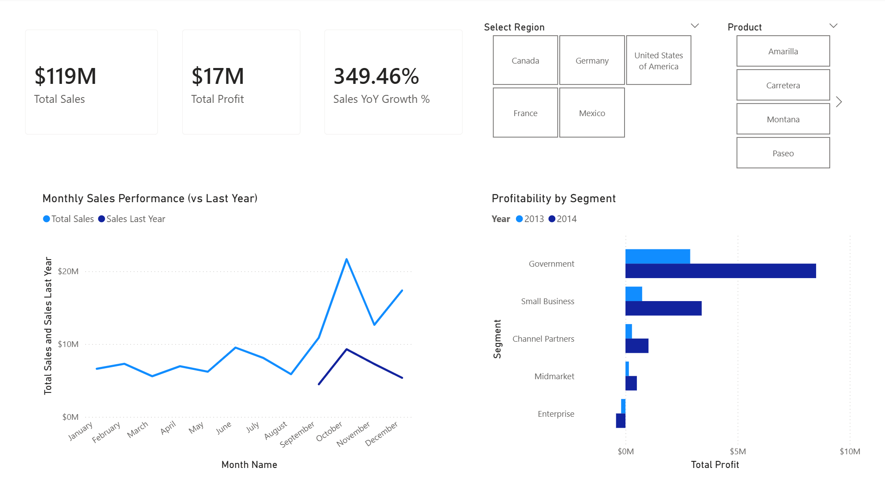

# Corporate Financial Performance Dashboard

This repository contains a full-stack BI project analyzing financial performance across multiple global segments. The goal was to build an automated data pipeline and a professional Star Schema model to enable high-performance reporting and scenario analysis.

## Project Overview

* **Tools Used:** Python (Pandas/SQLAlchemy), Microsoft SQL Server, Power BI, Excel.
* **Dataset:** Financial Sample (Sales, Profit, Segments) + Budget Targets.
* **Goal:** Build an executive "Header & Grid" dashboard to visualize Year-over-Year (YoY) growth and simulate cost-inflation scenarios.
* **[Download .pbix file](./Corporate_Financial_Dashboard.pbix)**



## Technical Implementation

### 1. Data Engineering (Python Automation & SQL)
Instead of relying on manual file imports, I built an automated pipeline to handle the data ingestion.

* **Python ETL:** Wrote a Python script (etl_pipeline.py) using **Pandas** to programmatically clean the raw CSV logs (stripping currency symbols like '$' and ',') and auto-detect data types.
* **SQL Loading:** Used **SQLAlchemy** to automatically generate the table structure and insert the cleaned data into **SQL Server**, replacing manual "Import Wizards".

### 2. Data Modeling (Hybrid Star Schema)
Transformed disparate sources into a unified Star Schema to enable multi-source reporting.

* **Hybrid Architecture:** Connected Power BI to two different sources simultaneously:
    * **SQL Server:** For the main transactional data (Sales_FACT).
    * **Excel:** For budget targets to prove "Diverse Source" integration.
* **Dimension Creation:** Created a shared Dim_Country dimension by referencing the SQL source and removing duplicates, allowing me to filter both SQL and Excel data with one slicer.
* **Cardinality:** Established **One-to-Many (1:*)** relationships between Dimensions and Fact tables.

### 3. Scenario Analysis & Advanced DAX
I moved beyond static reporting by engineering a "What-If" parameter showing how a 10% cost increase impacts projected profit to help stakeholders visualize risk.


* **Cost Simulation:** Created a dynamic parameter to simulate a **Supply Chain Cost Increase** (0-20%).
* **Projected Profit Measure:**
    ```dax
    Projected Profit =
    VAR CostFactor = 1 + 'Cost Increase Simulation'[Value]
    RETURN [Total Sales] - (SUM(Sales_FACT[COGS]) * CostFactor)
    ```
* **Time Intelligence:** Implemented a dynamic **Dim_Date** using **CALENDAR** and **ADDCOLUMNS** to ensure continuous timelines for YoY calculations, preventing breaks caused by missing weekend data.

### 4. Dashboard Layout
Designed using the **"Header & Grid"** layout for executive readability:
* **Header:** Top-row KPI Cards (Sales, Profit, Growth) aligned with Dropdown Slicers (Region, Product) to maximize screen real estate.
* **Grid:** Side-by-side comparison of **Monthly Trends** (Line Chart) and **Segment Profitability** (Clustered Bar Chart).

---

## Notes
* **Data Source:** Microsoft Financial Sample & Custom Target Data.
* **ETL Strategy:** Text-based columns were removed from the Fact table after merging to reduce file size and improve processing speed.
* **Provided here for learning and demonstration purposes.**
